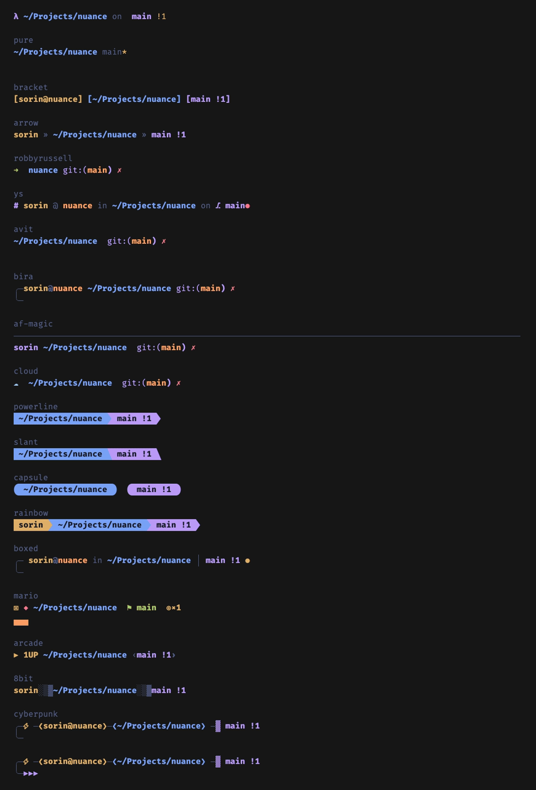

# nuance — gallery

Every **theme**, **style** and **look** at a glance.
Usage & commands are in the [main README](README.md#theming--styling).

- [Themes (26)](#themes-26)
- [Prompt styles (22)](#prompt-styles-22)
- [Looks (31)](#looks-31)

---

## Themes (26)

Every theme's palette at a glance:

A selection with recolored syntax + tables:

More of the newer themes (nord, rosé pine, everforest, kanagawa, ayu, onedark,
solarized, super-mario):

Light themes on a light terminal background:

**Dark:** `gruvbox` · `catppuccin-mocha` · `catppuccin-macchiato` ·
`catppuccin-frappe` · `tokyo-night` · `nord` · `dracula` · `rose-pine` ·
`rose-pine-moon` · `everforest` · `kanagawa` · `onedark` · `monokai` ·
`ayu-dark` · `ayu-mirage` · `night-owl` · `github-dark` · `oxocarbon` ·
`zenburn` · `solarized` · `super-mario` · `cyberpunk` (neon)

**Light:** `catppuccin-latte` · `rose-pine-dawn` · `github-light` ·
`solarized-light`

---

## Prompt styles (22)

Every style rendered once:

Cycling a few live:

| Style          | Description                                                     |
|----------------|----------------------------------------------------------------|
| `full`         | `user@host in ~/path on  branch +git` (default)              |
| `compact`      | `…/last2/dirs on  branch +git`                               |
| `minimal`      | `dirname on  branch`                                         |
| `lambda`       | `λ ~/path on  branch +git`                                   |
| `pure`         | two-line, [pure](https://github.com/sindresorhus/pure)-like    |
| `bracket`      | ASCII `[user@host] [path] [git]` — no Nerd Font needed         |
| `arrow`        | `user » path » git` — no Nerd Font needed                      |
| `robbyrussell` | oh-my-zsh default — `➜  dir git:(branch) ✗`                    |
| `ys`           | oh-my-zsh `ys` — `# user @ host in ~/dir on ⎇ branch●`         |
| `avit`         | oh-my-zsh `avit` — clean two-line + `git:(branch)`             |
| `bira`         | oh-my-zsh `bira` — `╭─user@host ~/dir` / `╰─➤`                  |
| `af-magic`     | oh-my-zsh `af-magic` — full-width rule + info line             |
| `cloud`        | oh-my-zsh `cloud` — `☁  ~/dir git:(branch)`                     |
| `powerline`    | Nerd-Font segments with `` separators                        |
| `slant`        | Nerd-Font slanted segment separators                          |
| `capsule`      | Nerd-Font rounded "pill" segments                             |
| `rainbow`      | Nerd-Font powerline, each segment its own color               |
| `boxed`        | two-line box-drawing with a `●` clean/dirty marker            |
| `mario`        | two-line 🍄 overworld — `▣`?-block, `◆` hero, `⚑` flag, `◉` coins, `▄` ground |
| `arcade`       | retro all-caps `▶ 1UP` score line                             |
| `8bit`         | pixel `░▒▓` gradient separators                                |
| `cyberpunk`    | two-line neon box-drawing with `⚡` and `▶▶▶`                   |

Game-inspired styles on the Super Mario theme:

---

## Looks (31)

A **look** is a curated theme + style pairing.

| Look                | Theme                  | Style          |
|---------------------|------------------------|----------------|
| `cyberpunk`         | cyberpunk              | cyberpunk      |
| `synthwave`         | cyberpunk              | capsule        |
| `gruvbox`           | gruvbox                | full           |
| `gruvbox-minimal`   | gruvbox                | minimal        |
| `mocha-pure`        | catppuccin-mocha       | pure           |
| `macchiato-lambda`  | catppuccin-macchiato   | lambda         |
| `latte-compact`     | catppuccin-latte       | compact        |
| `tokyo-powerline`   | tokyo-night            | powerline      |
| `tokyo-capsule`     | tokyo-night            | capsule        |
| `nord-lambda`       | nord                   | lambda         |
| `dracula-slant`     | dracula                | slant          |
| `rose-pine-pure`    | rose-pine              | pure           |
| `everforest-boxed`  | everforest             | boxed          |
| `kanagawa-capsule`  | kanagawa               | capsule        |
| `onedark-bracket`   | onedark                | bracket        |
| `solarized-full`    | solarized              | full           |
| `monokai-rainbow`   | monokai                | rainbow        |
| `ayu-arrow`         | ayu-dark               | arrow          |
| `night-owl-pure`    | night-owl              | pure           |
| `github-arrow`      | github-dark            | arrow          |
| `oxocarbon-rainbow` | oxocarbon              | rainbow        |
| `rose-moon-boxed`   | rose-pine-moon         | boxed          |
| `robbyrussell`      | onedark                | robbyrussell   |
| `ys`                | night-owl              | ys             |
| `avit`              | tokyo-night            | avit           |
| `bira`              | nord                   | bira           |
| `af-magic`          | dracula                | af-magic       |
| `cloud`             | catppuccin-frappe      | cloud          |
| `super-mario`       | super-mario            | mario          |
| `arcade`            | super-mario            | arcade         |
| `8bit`              | gruvbox                | 8bit           |
