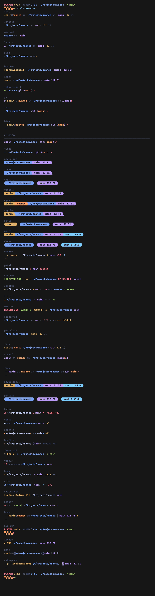

# nuance — gallery

Every **theme**, **style** and **look** at a glance.
Usage & commands are in the [main README](README.md#theming--styling).

- [Themes (59)](#themes-59)
- [Prompt styles (40)](#prompt-styles-40)
- [Looks (62)](#looks-62)

---

## Themes (59)

Every theme's palette at a glance:

A selection with recolored syntax + tables:

More of the newer themes (nord, rosé pine, everforest, kanagawa, ayu, onedark,
solarized, super-mario):

Light themes on a light terminal background:

**Dark:** `gruvbox` · `gruvbox-material` · `catppuccin-mocha` ·
`catppuccin-macchiato` · `catppuccin-frappe` · `tokyo-night` ·
`tokyo-night-storm` · `tokyo-night-moon` · `nord` · `dracula` · `rose-pine` ·
`rose-pine-moon` · `everforest` · `kanagawa` · `kanagawa-dragon` · `onedark` ·
`monokai` · `ayu-dark` · `ayu-mirage` · `night-owl` · `github-dark` ·
`oxocarbon` · `zenburn` · `solarized` · `nightfox` · `flexoki` · `melange` ·
`nightfly` · `material-palenight` · `tomorrow-night` · `snazzy` · `iceberg` ·
`synthwave-84` · `cobalt2` · `modus-vivendi` · `horizon` · `sonokai` ·
`super-mario` · `cyberpunk` (neon)

**Game themes:** `clair-obscur` (Expedition 33) · `mario-underground` ·
`pip-boy` (Fallout) · `tarnished` (Elden Ring) · `hyrule` (Zelda) · `doom` — and
the light `clair-obscur-canvas` and `mario-overworld`.

**Light:** `catppuccin-latte` · `rose-pine-dawn` · `github-light` ·
`solarized-light` · `tokyo-night-day` · `gruvbox-light` · `dawnfox` ·
`kanagawa-lotus` · `flexoki-light` · `one-light` · `papercolor-light` ·
`modus-operandi` · `clair-obscur-canvas` · `mario-overworld`

**Yours:** anything you `nuance import` (Ghostty, kitty, Alacritty, base16).

---

## Prompt styles (40)

Every style rendered once:

Cycling a few live:

| Style          | Description                                                     |
|----------------|----------------------------------------------------------------|
| `full`         | `user@host in ~/path on  branch +git` (default)              |
| `compact`      | `…/last2/dirs on  branch +git`                               |
| `minimal`      | `dirname on  branch`                                         |
| `lambda`       | `λ ~/path on  branch +git`                                   |
| `pure`         | two-line, [pure](https://github.com/sindresorhus/pure)-like    |
| `bracket`      | ASCII `[user@host] [path] [git]` — no Nerd Font needed         |
| `arrow`        | `user » path » git` — no Nerd Font needed                      |
| `robbyrussell` | oh-my-zsh default — `➜  dir git:(branch) ✗`                    |
| `ys`           | oh-my-zsh `ys` — `# user @ host in ~/dir on ⎇ branch●`         |
| `avit`         | oh-my-zsh `avit` — clean two-line + `git:(branch)`             |
| `bira`         | oh-my-zsh `bira` — `╭─user@host ~/dir` / `╰─➤`                  |
| `af-magic`     | oh-my-zsh `af-magic` — full-width rule + info line             |
| `cloud`        | oh-my-zsh `cloud` — `☁  ~/dir git:(branch)`                     |
| `powerline`    | Nerd-Font segments with `` separators                        |
| `slant`        | Nerd-Font slanted segment separators                          |
| `capsule`      | Nerd-Font rounded "pill" segments                             |
| `rainbow`      | Nerd-Font powerline, each segment its own color               |
| `agnoster`     | Nerd-Font powerline with user, host, path and git              |
| `skyline`      | Nerd-Font slanted segments for user, path and git              |
| `pills`        | Nerd-Font rounded pills for user, path and git                 |
| `pastel`       | Nerd-Font powerline: user, path, git + toolchain (`lang` module) |
| `devbar`       | Nerd-Font pills: exit code, ssh, path, git, toolchain, jobs    |
| `expedition33` | Clair Obscur: Expedition 33 — Belle Époque two-liner: gold `❖ ✦ ⚜` ornaments, `✶` Gommage marks|
| `gommage`      | Clair Obscur — a red `✿` petal falls for every changed file    |
| `vault`        | Fallout Pip-Boy — `[VAULT-111] … HP 75/100 ☢`                  |
| `grace`        | Elden Ring — `♥` HP / `✦` FP / `⚡` stamina bars; **YOU DIED** after a failed command|
| `triforce`     | Zelda — `▲` Triforce, `♥♥♡` hearts, `◆` rupees                 |
| `doomguy`      | DOOM status bar — `HEALTH 75%  ARMOR 0  AMMO 3  ☺`             |
| `spaceship`    | spaceship — `path on  branch [!⇡] via rust 1.99`, two-line     |
| `p10k-lean`    | powerlevel10k lean — path + colored git state, two-line        |
| `fish`         | fish informative — `user@host ~/path (main|✚2…1)`              |
| `steeef`       | oh-my-zsh steeef — `user at host in ~/path [main●]`            |
| `fino`         | oh-my-zsh fino — `╭─ user at host in ~/path on git:main ✗` / `╰─○`|
| `powerline2l`  | Nerd-Font powerline segments with the prompt on its own line   |
| `pills2l`      | Nerd-Font pills with the prompt on its own line                |
| `boxed`        | two-line box-drawing with a `●` clean/dirty marker            |
| `mario`        | two-line NES HUD: `MARIO ◉×03  WORLD 3-4  ~/dir  ⚑ branch ▲▼✖⬢★`, then a brick ground with the `◆` hero |
| `arcade`       | retro all-caps `▶ 1UP` score line                             |
| `8bit`         | pixel `░▒▓` gradient separators                                |
| `cyberpunk`    | two-line neon box-drawing with `⚡` and `▶▶▶`                   |

Game-inspired looks — Clair Obscur: Expedition 33, Super Mario, Fallout, Elden Ring, Zelda, DOOM, Cyberpunk:

---

## Looks (62)

A **look** is a curated theme + style pairing.

| Look                | Theme                  | Style          |
|---------------------|------------------------|----------------|
| `cyberpunk`         | cyberpunk              | cyberpunk      |
| `synthwave`         | cyberpunk              | capsule        |
| `gruvbox`           | gruvbox                | full           |
| `gruvbox-minimal`   | gruvbox                | minimal        |
| `mocha-pure`        | catppuccin-mocha       | pure           |
| `macchiato-lambda`  | catppuccin-macchiato   | lambda         |
| `latte-compact`     | catppuccin-latte       | compact        |
| `tokyo-powerline`   | tokyo-night            | powerline      |
| `tokyo-capsule`     | tokyo-night            | capsule        |
| `nord-lambda`       | nord                   | lambda         |
| `dracula-slant`     | dracula                | slant          |
| `rose-pine-pure`    | rose-pine              | pure           |
| `everforest-boxed`  | everforest             | boxed          |
| `kanagawa-capsule`  | kanagawa               | capsule        |
| `onedark-bracket`   | onedark                | bracket        |
| `solarized-full`    | solarized              | full           |
| `monokai-rainbow`   | monokai                | rainbow        |
| `ayu-arrow`         | ayu-dark               | arrow          |
| `night-owl-pure`    | night-owl              | pure           |
| `github-arrow`      | github-dark            | arrow          |
| `oxocarbon-rainbow` | oxocarbon              | rainbow        |
| `rose-moon-boxed`   | rose-pine-moon         | boxed          |
| `robbyrussell`      | onedark                | robbyrussell   |
| `ys`                | night-owl              | ys             |
| `avit`              | tokyo-night            | avit           |
| `bira`              | nord                   | bira           |
| `af-magic`          | dracula                | af-magic       |
| `cloud`             | catppuccin-frappe      | cloud          |
| `super-mario`       | super-mario            | mario          |
| `arcade`            | super-mario            | arcade         |
| `8bit`              | gruvbox                | 8bit           |
| `dracula-agnoster`  | dracula                | agnoster       |
| `tokyo-skyline`     | tokyo-night            | skyline        |
| `nord-pills`        | nord                   | pills          |
| `storm-devbar`      | tokyo-night-storm      | devbar       |
| `moon-pills`        | tokyo-night-moon       | pills        |
| `day-agnoster`      | tokyo-night-day        | agnoster     |
| `gruvbox-light-pure`| gruvbox-light          | pure         |
| `palenight-powerline`| material-palenight     | powerline    |
| `nightfox-skyline`  | nightfox               | skyline      |
| `dawnfox-compact`   | dawnfox                | compact      |
| `synthwave84-capsule`| synthwave-84           | capsule      |
| `flexoki-lambda`    | flexoki                | lambda       |
| `melange-arrow`     | melange                | arrow        |
| `snazzy-rainbow`    | snazzy                 | rainbow      |
| `modus-pure`        | modus-vivendi          | pure         |
| `expedition-33`      | clair-obscur           | expedition33 |
| `gommage`            | clair-obscur           | gommage      |
| `canvas-33`          | clair-obscur-canvas    | expedition33 |
| `mario-world`        | mario-overworld        | mario        |
| `mario-underground`  | mario-underground      | mario        |
| `vault-111`          | pip-boy                | vault        |
| `tarnished`          | tarnished              | grace        |
| `hyrule`             | hyrule                 | triforce     |
| `doom`               | doom                   | doomguy      |
| `spaceship-nord`     | nord                   | spaceship    |
| `p10k-tokyo`         | tokyo-night            | p10k-lean    |
| `fish-gruvbox`       | gruvbox                | fish         |
| `steeef-mocha`       | catppuccin-mocha       | steeef       |
| `fino-dracula`       | dracula                | fino         |
| `onedark-twoline`    | onedark                | powerline2l  |
| `rosepine-pills2l`   | rose-pine              | pills2l      |
